# GIT

> git 이란

분산 <u>버전 관리 프로그램</u>

- 버전 : 컴퓨터 소프트웨어의 특정 상태

- 관리 : 어떤 일의 사무, 시설이나 물건의 유지·개량

- 프로그램 : 컴퓨터에서 실행될 때 특정 작업을 수행하는 일련의 명령어들의 모음

---

- 코드의 히스토리(버전)을 관리하는 도구

- 개발되어온 과정 파악 가능

- 이전 버전과는 변경 사항 비교 및 분석

- <mark>변동된 사항</mark>만을 저장하고 있다.

---

- github
  
  - 공개적
  
  - '싸피'' 단어 빼고 업로드하기
  
  - 과제 시험 업로드 X
  
  - 마이크로소프트꺼 사용

- gitlab
  
  - 프라이빗
  
  - 싸피 사람들만 사용 가능
  
  - 따로 만들 수 있음

- Git =/= github

---

- 중앙 집중 -> 중앙 서버 문제시 파급 多

> Repository

- 특정 디렉토리를 버전 관리하는 저장소

- git init 명령어로 로컬 저장소를 생성
  
  - 숨겨진 폴더로 저장되어 있음

- .git 디렉토리에 버전 관리에 필요한 모든 것이 들어있음
  
  - ~~master : branch~~

> git 기본기

- README.md  생성하기
  
  - 새 폴더를 만들고 README.md 파일을 생성
  
  - 이 파일을 버전 관리하며 git 사용
    
    -> 특정 버전으로 남긴다 = <mark>커밋(commit)</mark>한다

---

- working directory
  
  - 내가 작업하고 있는 실제 디렉토리
  
  - 물리적인 위치
  
  - 실제로 git으로 관리하고 있는 것이 아님 -> staging area에 올려놔야됨 (=git add)
  
  - git이 추적하고 있지 않은 상태 (= untracked)
  
  - track 후 다시 수정하면 자동으로 업뎃 후 staging area에 업로드됨

- staging area
  
  - 커밋으로 남기고 싶은, 특정 버전으로 관리하고 싶은 파일이 있는 곳
  
  - 특정 버전으로 넘기기 (= git commit)
    
    - -m 넣어서 이유를 넣어주는 거임.

- repository
  
  - 커밋들이 저장되는 곳
  
  - 버전 하나가 되는 것 (=committed)

---

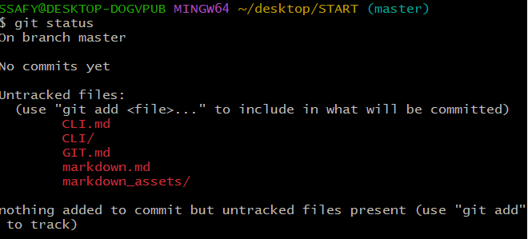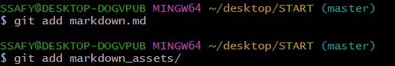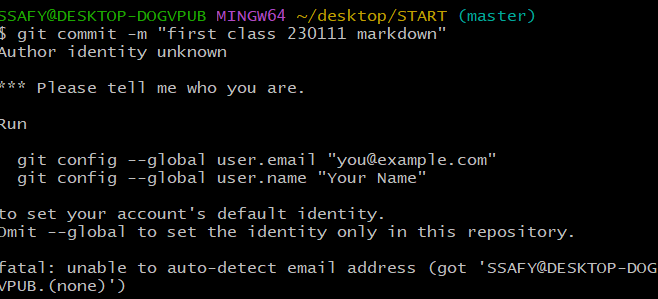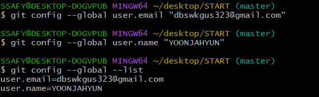

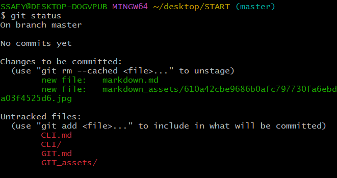

---

1. git status
   
   - 현재상태 표시

2. git add

3. git commit
   
   - -m : 메세지 작성

4. git log
   
   - 내가 남긴 버전 확인 가능
   - git --oneline
     - 한줄로 볼 수 있다.
   - git log -- oneline -- graph
   - 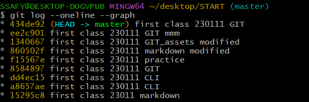

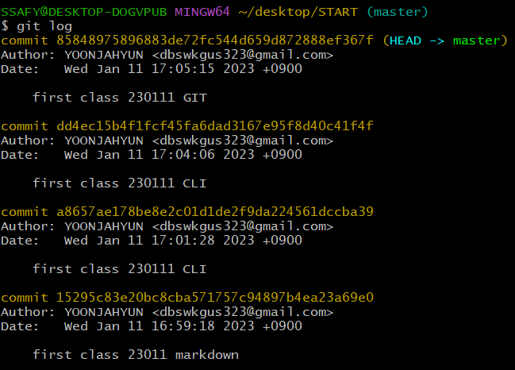

5. 다 넣으면 암것도 없다
   
   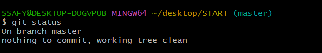

6. git.txt 생성

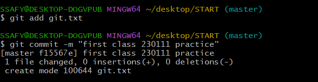

7. 메모장에 내용 추가 후 git status 확인

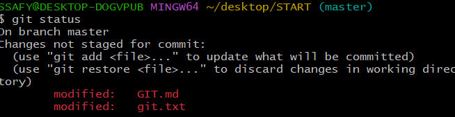

-> 수정됨을 보여줌

8. 수정된 버전을 없애고 싶다?
   
   -> 지금 안하고 나중에 배울거임

9. 너무 많으면 Q 누르면 나가기 가능

---

- git init
  
  - 로컬 저장소임
  
  - 초기화

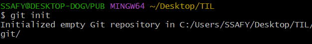

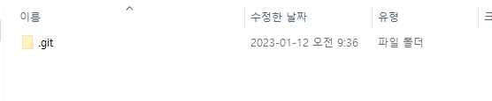
