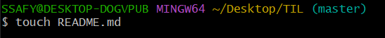
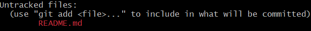
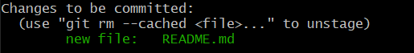
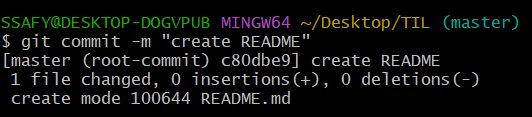
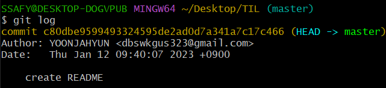
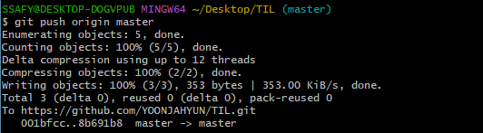
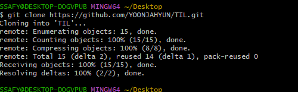

# Git 복습

1. readme.md 만들기

2. 버전1만들거임 
   
   - staging area로 옮기는 것
   
   - git add README.md

->

3. 새 버전 만드는 것 
   
   - commit
     
     
   
   - 버전 1개 만들었으니 staging area 버리기

4. 완성

5. 새로운 수정사항
   
   - 대제목으로 첫  github
   
   - 중제목으로 readme 생성
   
   - git 초기화
   
   - git repo 생성
   
   - add와 commit 하기

---

- commit에서 어떤 버전인지 알려줘야됨 -m로

- 안하면 민트창 뜨고 insert키 누르기

- 메세지 쓰고 esc키 누르기

- 쓰고 종료해줘 = `:wq`

---

code ~/.gitconfig

- 내 정보 수정 가능

---

# Github

- git 으로 버전만 관리

- git remote -V
  
  - 내 주소 확인 가능
  - git remote add origin 사용할 주소
    - 거기에다가 업로드됨

- git push origin master
  
  - 이를 통해 원격저장소에 업로드가 된다.
  
  - 

---

- 추가된거 초록

- 원래버전 빨강

---

- git clone
  
  - 
  
  - -> 다시 작업물 다운로드 가능 (원격저장소에서 집으로 다운)
  
  - 집에서 그럼 git이 생긴거임
  
  - til 폴더에는 git에대한 정보 저장소 로그, 모든 것들이 들어있다.
  
  - 처음에만 하면됨

- git pull 
  
  - 수정된 파일 다시 받아오기임

> 파일 이름 수정 후? or pull 안받았을 때

- 원래파일 삭제 후 새로 생겼다는 느낌으로 되는 것

- git pull 하면 합병이된다.

- 합병된 것 중에 필요없으면 지우면 됨. 그리고 저장해

- 다시 status 확인 후 다시 add하고 commit 해. git push origin master 하면돼

- git add . 
  
  - 현재폴더 모두 add한 것
